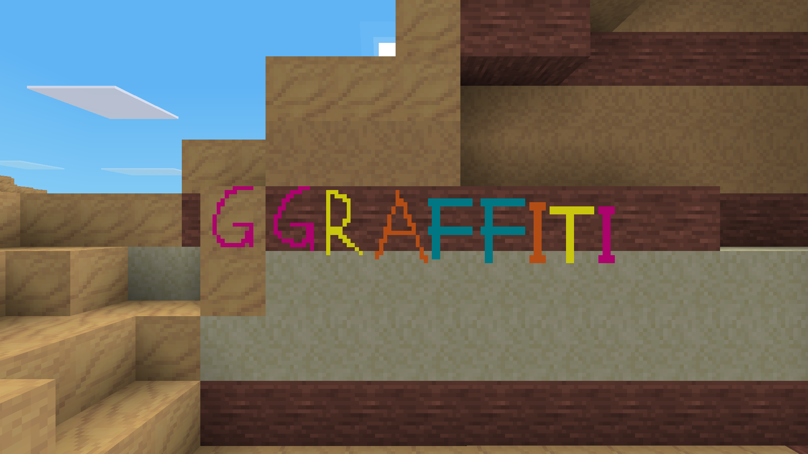
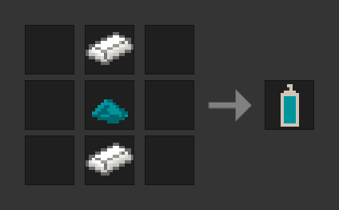
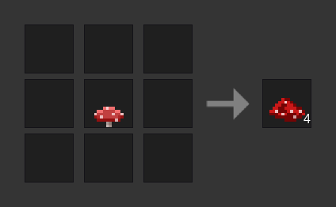
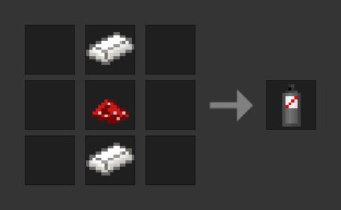

# GGraffiti

This Minetest mod adds graffiti that lets you paint whatever you want on any node you want. It requires at least Minetest 5.6.0.

## Items

**Graffiti Spray Can**

Press and hold the dig button (the one you normally use to remove blocks) to paint. After some time the spray can will be empty. You can smelt spray cans, empty or not, to get the two steel ingots back. Of course, you can replace the cyan dye in the recipe with any dye you like.

**Red Mushroom Extract**

**Graffiti Remover Spray Can**

A spray can that removes graffiti. Essentially an eraser.

## License

© 2022 Gregor Parzefall

Source code (everything except image and audio files) available under the [GNU AGPL version 3.0](https://www.gnu.org/licenses/agpl-3.0.html) or any later version, media (image and audio files) available under the [CC BY-SA 4.0](https://creativecommons.org/licenses/by-sa/4.0/).

This licensing means, for example, that if you use a modified version of this mod on your server, you must provide the source code of that modified version to your players. For more information, please read the licenses.
