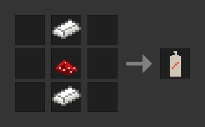

# GGraffiti

This Minetest mod adds graffiti that lets you paint whatever you want on any node you want.

## Items

**Graffiti Spray Can**

Press and hold the dig button (the one you normally use to remove blocks) to paint. After some time the spray can will be empty. You can smelt spray cans, empty or not, to get the two steel ingots back. Of course, you can replace the cyan dye in the recipe with any dye you like.

**Red Mushroom Extract**

**Anti-Graffiti Spray Can**

A spray can that removes graffiti. Essentially an eraser.
