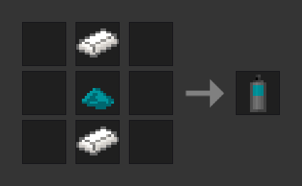
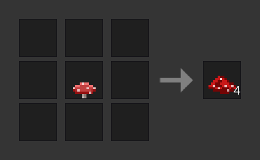

# GGraffiti

This Minetest mod adds graffiti that lets you paint whatever you want on any node you want. It requires at least Minetest 5.6.0.

[More screenshots](./SCREENSHOTS.md)

Features:

- Paint pixel-by-pixel on any node
- Paint in any color with the RGB spray can
- [Experimental] Paint up to 5×5 pixels at a time
- Remove graffiti with the eraser-like "remover" spray can or by digging the sprayed nodes
- Respects protection mods
- Compatible with Minetest Game and MineClone 2

This mod is a Work in Progress.

## Items

**Graffiti Spray Can**

Press and hold the dig button (the left mouse button) to paint. Press the place button (the right mouse button) to change the size.

After some time, the spray can will be empty. You can smelt spray cans, empty or not, to get the two steel ingots back. Of course, you can replace the cyan dye in the recipe with any dye you like.

If you are playing on Android: For the best spraying experience, enable `Settings` → `All Settings` → `touch_use_crosshair`.

**RGB Graffiti Spray Can**

A spray can that can paint in any 24-bit RGB color and thus in all colors supported by Minetest. Press the place button (the right mouse button) to change the selected color.

**Red Mushroom Extract**

**Graffiti Remover Spray Can**

A spray can that removes graffiti. Essentially an eraser.

If you want to remove a lot of graffiti at once, you can simply dig the affected nodes and place them again. This will remove all graffiti that is on them.

## Changelog

`v1.0.0-alpha.11` (Apr 30, 2023)

- Experimental support for painting with different "brush sizes"

`v1.0.0-alpha.10` (Mar 12, 2023)

- Support for MineClone 2

`v1.0.0-alpha.9` (Mar 4, 2023)

- Addition of the "RGB Graffiti Spray Can"
- New textures that were contributed by Tim79000

`v1.0.0-alpha.8` (Feb 24, 2023)

- Graffiti is now removed when you dig the node it is attached to.
- Performance improvements

## License

© 2022 Gregor Parzefall

Source code (everything except image and audio files) available under the [GNU AGPL version 3.0](https://www.gnu.org/licenses/agpl-3.0.html) or any later version, media (image and audio files) available under the [CC BY-SA 4.0](https://creativecommons.org/licenses/by-sa/4.0/).

This licensing means, for example, that if you use a modified version of this mod on your server, you must provide the source code of that modified version to your players. For more information, please read the licenses.

**Exceptions**

`textures/ggraffiti_spray_can.png`, `textures/ggraffiti_spray_can_color.png` and `textures/ggraffiti_spray_can_remover.png` by [Tim79000](https://github.com/Tim79000) ([CC BY-SA 4.0](https://creativecommons.org/licenses/by-sa/4.0/)), modified by Gregor Parzefall

`docpics/screenshot_2.png` and `docpics/screenshot_3.png` by [Lemente](https://github.com/Lemente) ([CC0 1.0](https://creativecommons.org/publicdomain/zero/1.0/))
